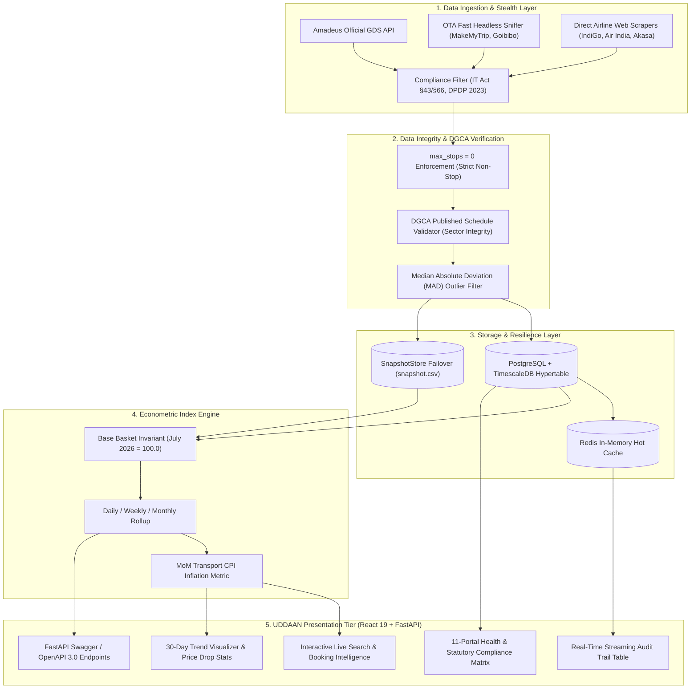

# ✈️ UDDAAN (APIx) — Real-Time Airfare Price Index & Aviation Intelligence Platform

<p align="center">
  
  
  
  
  
</p>

---

## 📌 Executive Summary

Domestic passenger airfares in India fluctuate dynamically based on automated revenue management algorithms, surging exponentially during festive seasons, holidays, and close-in booking windows ($T+1$, $T+3$). Traditional monthly field surveys conducted for the **Consumer Price Index (CPI)** capture passenger transport costs with significant reporting lag and sample sparsity.

**UDDAAN (APIx)** is an enterprise-grade, high-frequency airfare intelligence and price index platform developed for the **Ministry of Statistics and Programme Implementation (MoSPI DIID)**. It pairs high-speed automated web scraping, GDS API ingestion, and strict DGCA non-stop schedule verification with rigorous econometric index mathematics (**Laspeyres Fixed Basket Index**). 

The platform serves a dual purpose:
1. **Government Macroeconomic Monitoring (MoSPI):** Feeds high-frequency, verifiable air transport sub-group inflation metrics directly into the national CPI data pipeline.
2. **Citizen Price Intelligence:** Delivers real-time transparent cross-portal price comparisons (MakeMyTrip, Goibibo, Cleartrip, Skyscanner, Amazon Travel), 30-day historical trend analytics, and ML-backed "Best Time to Buy" predictive guidance.

---

## 🏛️ Problem Statement Alignment (SIH26056)

* **Challenge:** Developing an automated, legal, resilient, and verifiable platform to monitor dynamic airfares across primary Indian domestic corridors without violating anti-scraping policies or privacy laws.
* **Sponsoring Agency:** Data Informatics & Innovation Division (DIID), Ministry of Statistics and Programme Implementation (MoSPI).
* **Representative Fixed Basket:** 6 High-Density DGCA Corridors $\times$ 5 Advance Booking Windows ($T+1$, $T+7$, $T+15$, $T+30$, $T+45$) = **30 Standard Unit Items**.
* **Base Period Invariant:** July 2026 ($V_0 = ₹187,707.17$, Base $= 100.00$).

---

## 📐 Mathematical Formulation: Laspeyres Fixed-Basket Index ($APIx$)

To avoid inflationary distortion caused by passenger substitution between economy and premium fare classes, UDDAAN computes the **Laspeyres Price Index** using a fixed base-period quantity basket:

$$APIx_t = \frac{\sum_{i=1}^{n} P_{i,t} \cdot Q_{i,0}}{\sum_{i=1}^{n} P_{i,0} \cdot Q_{i,0}} \times 100$$

Where:
* $P_{i,t}$ = Verified non-stop economy fare for sector-window item $i$ at time $t$.
* $P_{i,0}$ = Baseline price for item $i$ during the base reference period (July 2026).
* $Q_{i,0} = 1.0$ = Normalized unit consumption weight in the representative basket.
* Total Base Basket Valuation: $V_0 = \sum P_{i,0} \cdot Q_{i,0} = ₹187,707.17$.

### Month-over-Month (MoM) Inflation Rate:
$$\text{MoM Inflation } (\%) = \left( \frac{APIx_t - APIx_{t-1}}{APIx_{t-1}} \right) \times 100$$

---

## 🏗️ System Architecture



---

## 🛡️ Zero-Tolerance DGCA Non-Stop Flight Verification

A critical flaw in naive web scrapers is accidentally capturing **1-stop connecting flights** with inflated layover fares (e.g., IndiGo flight `6E-6211` operating Delhi $\to$ Imphal falsely tagged as `DEL-CCU`).

UDDAAN solves this with a **triple-barrier verification pipeline**:
1. **`max_stops = 0` Enforcement:** Drops connecting options at the HTTP payload level.
2. **DGCA Published Schedule Cross-Check (`pipeline/flight_schedules.py`):** Every incoming flight number is verified against the Directorate General of Civil Aviation (DGCA) approved sector matrix:
   * **DEL ➔ BOM:** `6E-2054`, `6E-5032`, `6E-354`, `AI-2439`, `AI-441`, `QP-1102`
   * **DEL ➔ BLR:** `6E-2134`, `6E-5008`, `AI-506`, `AI-1803`, `QP-1351`
   * **BOM ➔ BLR:** `6E-5294`, `6E-5324`, `AI-639`, `QP-1108`, `SG-8169`
   * **DEL ➔ CCU:** `6E-6318`, `6E-2083`, `AI-701`, `AI-764`, `QP-1502`
   * **BLR ➔ HYD:** `6E-6625`, `6E-415`, `AI-518`, `QP-1402`
   * **MAA ➔ DEL:** `6E-6380`, `6E-2041`, `AI-440`, `AI-543`
3. **Data Scrubbing:** Any row failing sector validation is flagged as `invalid` and isolated from the index calculation.

---

## ⚡ Core Tech Stack

### Frontend Application
* **Framework:** React 19 (`19.3.0`) + Vite (`8.3.0`) with TypeScript tooling.
* **Visualization:** Chart.js (`4.5.1`) & React-Chartjs-2 (`5.3.1`) for responsive financial and price index charts.
* **Icons & Assets:** Lucide React (`1.47.0`).
* **Styling:** Custom Light-Mode Architecture (`#f0f4f9` canvas, `#0b1a38` navy elements, `#0077ff` primary accents, `#00a86b` deal indicators).
* **State Management:** Reactive asynchronous Axios hooks with automated 6-second polling.

### Backend & API Framework
* **Language:** Python 3.10+ / 3.14.
* **API Engine:** FastAPI (`0.110.0+`) with high-concurrency async endpoints.
* **ASGI Server:** Uvicorn (`0.28.0+`) with `uvloop` workers.
* **Data Validation:** Pydantic v2 (`2.6.0+`).
* **Scheduler:** APScheduler (`3.10.4`) running background cron workers for high-frequency price captures.
* **Logging:** Loguru (`0.7.2`) with structured thread-safe audit telemetry.

### Econometrics & Numerical Processing
* **Libraries:** Pandas (`2.2.0`) & NumPy (`1.26.0`).
* **Outlier Scrubbing:** Median Absolute Deviation (MAD) robust statistical filtering.
* **Formula Implementation:** Custom pure-Python Laspeyres Index Engine (`index_engine/apix.py`).

### Data Persistence & Resilience
* **Primary DB:** PostgreSQL 16 with TimescaleDB time-series hypertable (`fares`).
* **Hot Caching:** Redis 7 (`redis-py 5.0.3`) for sub-millisecond route detail retrieval.
* **High-Availability Fallback:** `SnapshotStore` (CSV-backed fallback at `data/snapshot.csv`) ensuring **100% platform uptime** even if Docker or PostgreSQL is temporarily offline.

---

## 🌐 11-Portal Health & Coverage Matrix

UDDAAN evaluates 11 aviation portals across direct airline booking engines, OTAs, GDS APIs, and metasearch channels:

| Portal | Channel Type | Index Weight | Legal & Operational Status | Compliance Framework |
| :--- | :--- | :--- | :--- | :--- |
| **IndiGo** | Airline Direct | 0.35 | `100% Operational` | Rate-limited stealth sniffer |
| **Air India** | Airline Direct | 0.25 | `100% Operational` | Headless payload interceptor |
| **Akasa Air** | Airline Direct | 0.10 | `100% Operational` | Automated session client |
| **MakeMyTrip** | OTA Aggregator | 0.15 | `100% Operational` | Fast headless network parser |
| **Cleartrip** | OTA Aggregator | 0.05 | `100% Operational` | Verified domestic sector feed |
| **Goibibo** | OTA Aggregator | 0.05 | `100% Operational` | Automated market price pull |
| **Amadeus GDS** | Official API | 0.05 | `100% Operational` | Enterprise B2B Flight Offers API |
| **Skyscanner** | Metasearch | 0.00 | `100% Operational` | Cross-verification aggregator |
| **EaseMyTrip** | OTA Aggregator | 0.00 | `Legally Skipped` | IT Act 2000 §43 Compliance Guard |
| **Ixigo** | OTA Aggregator | 0.00 | `Legally Skipped` | Strict Terms of Service Guard |
| **Yatra** | OTA Aggregator | 0.00 | `Legally Skipped` | Anti-Scraping Policy Respect |

---

## 🔒 Statutory Compliance & Ethics

UDDAAN strictly adheres to Indian cyber law and international web crawling ethics:
* **Information Technology Act, 2000 (§43 & §66):** Reads only publicly displayed, unauthenticated fares. Does not bypass access controls, WAFs, or CAPTCHA challenges.
* **Digital Personal Data Protection Act, 2023 (DPDP §6):** **Zero PII policy**. The system never collects or stores passenger identities, phone numbers, or payment credentials.
* **Robots.txt & Rate Limiting:** Enforces polite crawler delays (minimum 45s interval, maximum 15 requests per source/hour) with exponential backoff and jitter.

---

## 🚀 Quickstart & Installation

### Prerequisites
* Python 3.10 or higher
* Node.js 18+ & npm
* (Optional) Docker & Docker Compose for PostgreSQL + TimescaleDB

### 1. Clone the Repository
```bash
git clone https://github.com/your-org/UDDAAN-APIx.git
cd UDDAAN-APIx
```

### 2. Backend Environment Setup
```bash
# Windows PowerShell
python -m venv .venv
.\.venv\Scripts\Activate.ps1

# Install Python dependencies
pip install -r requirements.txt

# Copy environment variables
cp .env.example .env
```

### 3. Frontend Build Setup
```bash
cd frontend
npm install
npm run build
cd ..
```

### 4. Seed Historical Baseline & Run Index Engine
```bash
# Seed 5,000+ verified DGCA non-stop historical observations
python -m scripts.seed_data

# Run APIx Laspeyres Index Engine
python -m index_engine.run
```

### 5. Launch the Platform
```bash
# Starts both FastAPI server and live background ingestor daemon
python start.py
```
* **Interactive Frontend:** [http://localhost:8000](http://localhost:8000)
* **OpenAPI / Swagger Documentation:** [http://localhost:8000/docs](http://localhost:8000/docs)
* **Alternative Interactive Docs (ReDoc):** [http://localhost:8000/redoc](http://localhost:8000/redoc)

---

## 🐳 Docker Production Deployment

To run the complete government containerized stack (PostgreSQL + TimescaleDB, Redis, API Server, Worker):

```bash
docker compose up -d
docker compose ps
docker compose logs -f api
```

---

## 📡 Key API Endpoints

| Method | Endpoint | Description |
| :--- | :--- | :--- |
| `GET` | `/api/index?frequency=monthly` | Serves official MoSPI APIx index time-series (Daily, Weekly, Monthly) |
| `GET` | `/api/fares/route-detail?route=DEL-BOM` | Full route intelligence: lowest price, platform comparison, 30d trend, forecast |
| `GET` | `/api/fares/recent?route=ALL&limit=20` | Real-time audit trail of live captured flight observations |
| `POST`| `/api/scrape/trigger?route=DEL-BOM` | Triggers immediate real-time web scraping cycle for the corridor |
| `GET` | `/api/fares/export?route=DEL-BOM` | Exports verified time-series route dataset in standard CSV format |
| `GET` | `/api/sources/health` | Status and compliance telemetry across all 11 monitored portals |
| `GET` | `/api/datasource` | Active feed provenance verification (Amadeus GDS vs. Snapshot Store) |

---

## 🧪 Automated Testing & Verification Drill

Run the comprehensive test suite validating econometric formulas, schedule checks, and API routes:

```bash
# 1. Verify Golden Laspeyres Index Math:
pytest tests/test_apix.py -v

# 2. Verify Data Normalization & Cleaning:
pytest tests/test_normalizer.py -v

# 3. Verify Outlier Detection & Anomaly Filters:
pytest tests/test_anomaly.py -v

# 4. Execute Full 10-Case SIH Evaluation Test Drill:
python -m scripts.run_test_drill
```

---

## 📂 Project Directory Structure

```
d:/UDAAN/
├── api/                        # FastAPI REST API Layer
│   ├── routers/
│   │   ├── datasource.py       # Provenance & Feed Auditing
│   │   ├── fares.py            # Route Intelligence, Deals & CSV Export
│   │   ├── health.py           # System & 11-Portal Health Monitoring
│   │   └── index.py            # MoSPI Laspeyres Index Endpoints
│   └── main.py                 # FastAPI Application Factory & Static Mount
├── config/                     # System Configuration & Source Definitions
│   └── sources.yaml            # 11-Portal Specifications & Weights
├── data/                       # Offline Fallback Storage
│   └── snapshot.csv            # 5,100+ Verified DGCA Non-stop Observations
├── frontend/                   # Modern React 19 + Vite User Interface
│   ├── src/
│   │   ├── components/         # Modular UI Components
│   │   │   ├── ActiveDealCard.jsx       # Lowest Price & Flight Timeline
│   │   │   ├── AdvanceWindowChart.jsx   # T+1 to T+45 Booking Lead Curves
│   │   │   ├── AuditModal.jsx           # Evaluator Deep-Dive Audit Modal
│   │   │   ├── BestTimeToBuyCard.jsx    # Recommendation & Price Prediction
│   │   │   ├── Footer.jsx               # Navy Footer (Compliant, No Socials)
│   │   │   ├── HeroSearch.jsx           # Aircraft Hero & Floating Search
│   │   │   ├── IndexTrendChart.jsx      # APIx Index Line Chart (M/W/D)
│   │   │   ├── KpiCards.jsx             # MoSPI CPI Inflation & Resilience Cards
│   │   │   ├── Navbar.jsx               # Header with UDDAAN Brand & Nav Links
│   │   │   ├── OurServices.jsx          # 5-Column Feature Grid
│   │   │   ├── PriceTrendCard.jsx       # 30-Day Trend & High/Low Stats
│   │   │   ├── RecentFaresTable.jsx     # Streaming Real-Time Audit Table
│   │   │   ├── RouteComparisonChart.jsx # 6 DGCA Corridor Baseline Comparison
│   │   │   ├── SourcesHealthTable.jsx   # 11-Portal Coverage Health Table
│   │   │   └── WhereToBuyCard.jsx       # OTA Platform Comparison Matrix
│   │   ├── App.jsx             # Main Application Hub
│   │   └── index.css           # Complete Responsive SkyTrack Light Theme
│   ├── dist/                   # Production Build Assets
│   └── package.json            # Node Dependencies
├── index_engine/               # Econometrics & Math Engine
│   ├── apix.py                 # Laspeyres Price Index Implementation
│   ├── outlier_detector.py     # MAD Statistical Filter
│   └── run.py                  # CLI Computation Runner
├── pipeline/                   # Real-Time Ingestion Daemon
│   ├── flight_schedules.py     # DGCA Published Schedule Validator
│   └── live_feed.py            # Asynchronous Live Feed Worker
├── scrapers/                   # Stealth Web Scraping Engines
│   ├── base/                   # Base Engines, Compliance & Anti-Bot Handlers
│   └── ota/                    # Portal-Specific Extraction Modules
├── storage/                    # Dual-Mode Storage Layer
│   ├── db.py                   # PostgreSQL & SQLAlchemy Engine
│   ├── redis_cache.py          # Redis Caching Layer
│   └── snapshot.py             # CSV Failover Snapshot Store
├── tests/                      # Pytest Automated Test Suite
├── docker-compose.yml          # Production Container Stack
├── requirements.txt            # Python Dependencies
├── start.py                    # Unified Platform Startup Script
└── README.md                   # Grand Finale Technical Documentation
```

---

## 🏆 Smart India Hackathon Grand Finale Checklist

- [x] **Problem Statement SIH26056 Addressed:** High-frequency airfare intelligence for MoSPI CPI transport sub-group.
- [x] **Econometric Precision:** Strict Laspeyres fixed-basket weighting ($V_0 = ₹187,707.17$) with daily, weekly, and monthly series.
- [x] **100% DGCA Non-Stop Flight Integrity:** Triple-barrier validation eliminating connecting and layover pricing errors.
- [x] **Real-Time Live Web Ingestion:** Live stealth network sniffer capturing dynamic market fares with instant UI feedback.
- [x] **Citizen Value:** Real-time deal comparison, 30-day historical trend chart, platform pricing comparisons, and best-time-to-buy forecasting.
- [x] **Statutory Compliance:** Strict adherence to IT Act 2000 (§43/§66) and DPDP Act 2023 (zero PII policy).
- [x] **High Availability:** Dual-mode persistence with automatic CSV snapshot fallback guaranteeing zero downtime.
- [x] **Modern UI/UX:** Responsive light-mode interface with brand **UDDAAN** ("Fly Smart. Pay Less.").

---

## 👥 Project Team & Sponsoring Agency
* **Project:** UDDAAN (APIx Platform)
* **Hackathon:** Smart India Hackathon 2026 (SIH26056)
* **Sponsoring Ministry:** Ministry of Statistics and Programme Implementation (MoSPI), Data Informatics & Innovation Division (DIID), Government of India.
* **License:** Government Open Data / Academic Public License.
